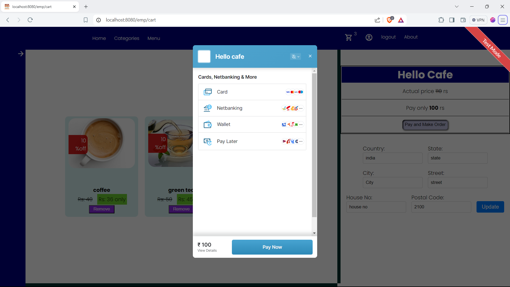

# Cafe-webb-App (An E-Commerce Restraunt app)
Our app provides a range of features including order management, inventory tracking, customer management, and sales reporting. With an intuitive interface and
powerful backend, managing your cafe has never been easier.
The Cafe Web App leverages the power of Spring Boot to deliver high performance and reliability. Whether you're a small cafe or a large chain, our app is designed
to meet your needs and help you grow your business
## Tech Stack
	- SpringBoot
	- Spring Security
	- Spring DataJPA
	- Thymeleaf
	- Razorpay
	- MySQL 8
	- JDK 21
	- Maven
	
---

## REFERENCE IMAGES
## Home Page
- user can visit home page without any sigup or login any other resouce would require user to login first

---
 
---
 
---
 
---

## Sign-UP page
- User can easily siging up by Entering the valid values
 

---
 

## Login Page
- User can browse and access the template/vies related to its role

####  ADMIN
		- Users with role ADMIN can access more feature and fcuntionality then other users for ex.
			- he can add employee
			- he can add category or items
			- he can access dashboard
			- he can manage orders etc
		- users with role customer one have one extra privilege then normal user that he can make bills for offline shopping
		- Users with role customer can vies and purchase items , vies or update profile etc

---
---

## Common views
These views are common for every type of user(ADMIN,CUSTOMER,EMPLOYEE)
## Profile page
User can view his profile and can even update it by pressing the update button
  

---
## Update profile
User can update both his address details and his personal details
 
 

---
---

## SideBar
User can either select Categories or menu from the side bar
**The Categories** option show the user all the available categories
 
---
whenever user click on any category , the related sub-items were displayed then he can select them to add to the cart
 
 
**The menu** Option will display the menu to the user with a navbar thar dispalys all the available products 

 
---
---

## CART
user can remove items from his cart or can order them he also can update his address before making any purchase 
 
### Payment
Razorpay pament gateway service is used to make online payments
 

## About page and the Error page
### About page
 
 
### Error Page

---
---
---

## Pages common to Employee and Admin
There is only one page/view is common between employee and Admin is the offline billing, Employee/Admin can use it to generate a order at their offline retail shop/shops

- User can brows through the category nav bar to select an item or search for that particular item on the search option, and after that he can select the quantities and add them to the bill
- the bill is a list of all selected items, their price,name and quantity

---

---
---
---

## ADMIN ONLY VIEWS 
these view/or sections can only be accessed by admin user
 
 
## DASHBOARD
Admin can view data and statistics on the dashboard

- he can select which time of data he wanted to see, then he can select that time from the time navigation bar 
Time options are 
	 - Previous day	
 	 - Today
	 - Last 7 days	
 	 - Last Year
	 - All time

The two main component of the dashboard are the 
### Info cards
The info cards are use to show the general basic information about product sales and income

1. The First card displays the information about the product which has the maximum sale 
1. The Second card displays the information about the product which has the minimum sale 
1. The Third card displays the information about the product which gives the maximum income 
1. The Fourth card displays the information about the product which gives the minimum income

### The Graph
The graph will display all the Sales and income related data of the selected time duration
Admin can view sales/income graph both at the same time or he can choose one 
Admin can also print the Dashboard

 
## Add option
Admin can add items/produtcs from this page , he can need to set a category for that new item or even he can create a new Category

- the basic information is needed to add any product/item

 

## Manage Items
Admin can update or remove items by going to the **Manage item** view, this view will first displays all the existed categories, after after selecting any one category the related subitems page will be displayed  to the admin, now he can either click on update button (this will display the update form) to update the item details or he can delete that item by clicking on delete item button
  
 ---
 
---
 
   
## Manage/Add employee
Admin cann make a existing user as employee by simply searching his/her name and updating the Role category, then he can all assign him/her post and salary

 

## View customer and Employee
Admin can view all the list of the Existing customers/Employee in the **View Customer/emp** section
He can view all together or he can choose one of the available categories(Employee , Customer) from the Drop down select option
### View All

 
 
### Customers
 
 
### Employees

 
---
---

## Manage orders
Admin can dispatch or cancel a order by going to **manage orders** page

